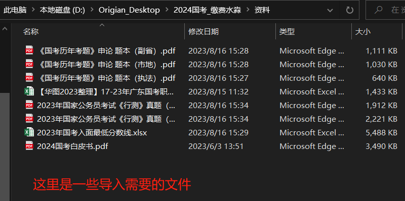
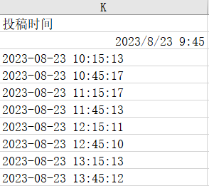
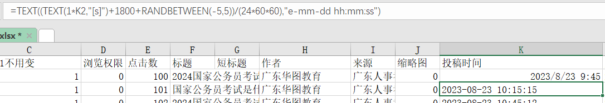

## 一、水淼文章生成操作

  

 

进入软件主页面,大致就是这么操作，选择合适的的元素填充进对应的模板，最后点预览，复制到后台发文页面预览页面效果。 
每次修改模板或者元素的内容都要点击一次保存，ctrl+s保存好像没用

  

 

大量修改元素的内容可以使用编辑器编辑

### 导出后的是一个.mdb格式的文件，再导出成.xlsx格式的excel文件

导出后是一个没有格式的文件，发文前需要对这个excel文件进行格式编辑  

1.把模板里面的第一行复制进去 
2.统一改栏目id和考试类型（对应的），如果有省份城市这些也要填 
3.内容对应内容，标题对应标题，关键词跟标题一样，但是分隔符要改成, 这样后台才可以发文 
4.作者和来源根据发文统一填一样的 
5.默认1，浏览权限默认0，缩略图默认0， 
6.点击数控制在100-500之间即可  
7.投稿时间那边复制一下模板的格式  
`=TEXT((TEXT(1*K2,"[s]")+1800+RANDBETWEEN(-5,5))/(24*60*60),"e-mm-dd hh:mm:ss")`  
1800代表1800秒，也就是0.5h  

  
  

  
  

格式全部弄好之后就可以导入了  

文章批量导入专用链接，密码：2022huatu或者huatu2022  
http://172.23.0.125/uigfwereytEWrws/sys_url_dmm.html   

##### 发文后台的‘所有导入列表’到时间会自动生成