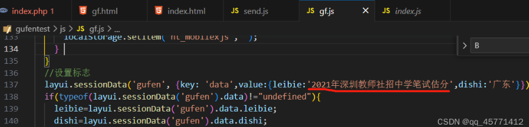
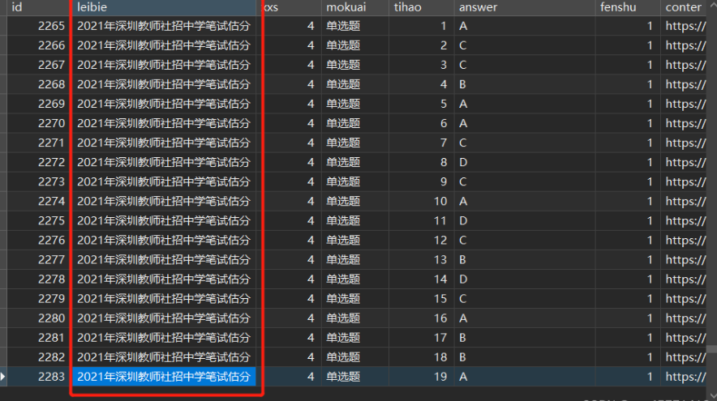
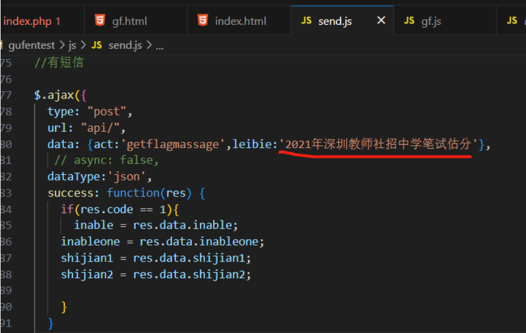
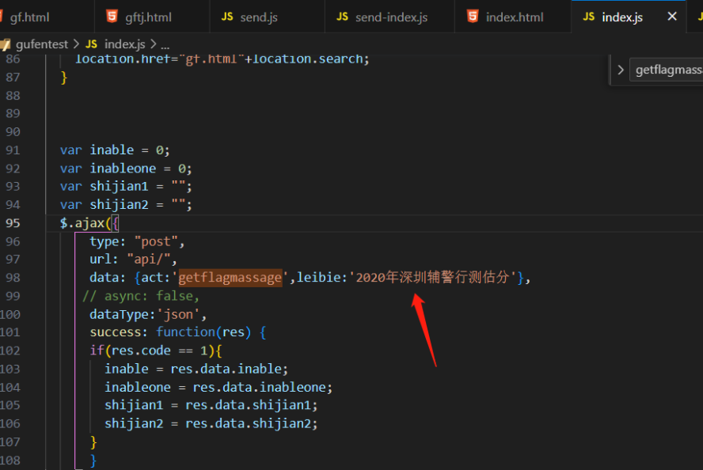
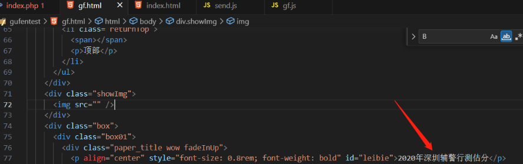
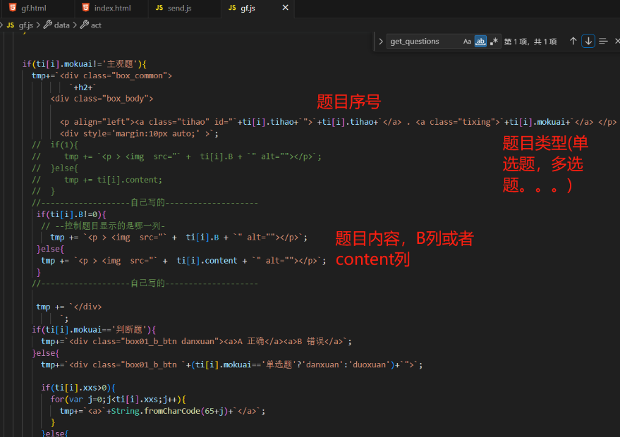
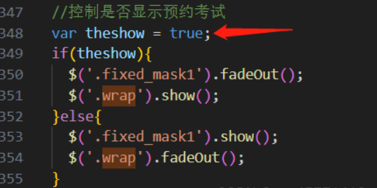

# 四、估分系统数据库拿试卷

## 一.修改试卷类别

### 1. gf.js

 
  

> 这里的 leibie:'==2021年深圳教师社招小学笔试估分==' 代表的是哪一份试卷，对应数据库的  

 
  
如果想要拿去其他试卷内容，修改此处即可，注意不要复制错！！  

### 2. send.js和index.js

> 同上一个js，这两处也要修改

 
  

 
  

### 3. 网站主页gf.html修改标题

 
  

## 二.获取题目逻辑

 
  

## 三、最后如需修改网站字段，也要修改。

### 网站主页预约考试和估分考试只能显示一个，在index.js文件里面控制

 
  

#### theshow = true 显示效果如下：

#### 设为false的效果如下：

