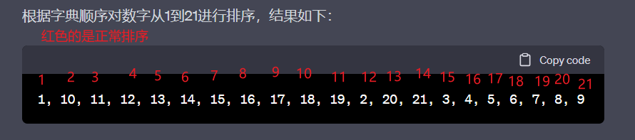
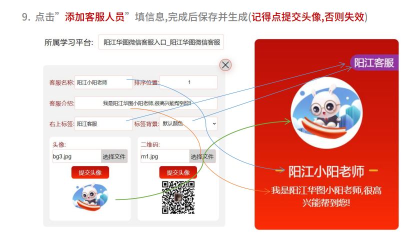
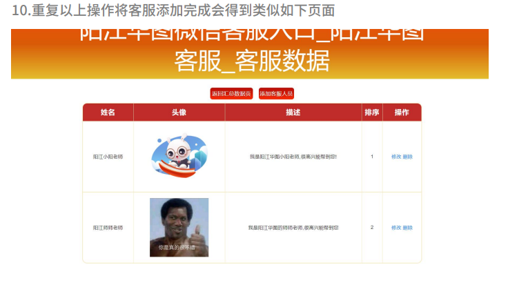
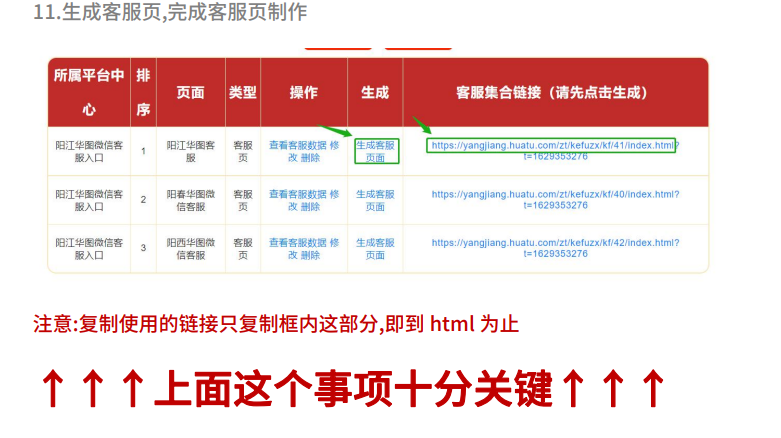

# 四、客服页更换客服老师头像和二维码操作

#### 1.进入这个网页 http://gd.huatu.com/zt/kefucreate/login/

账号：gd   
密码：c4d59f20   

#### 查看汇总页数据 -> 查看客服数据 -> 添加客服人员

> 添加客服页面的时候排序顺序按照这个来
> 
>  
> 
> 但是此处的排序是按照字典排序
> 
> 

### 所以添加客服的时候排序位置就填白色的数字进去即可。

 
  

 
  

 
  

