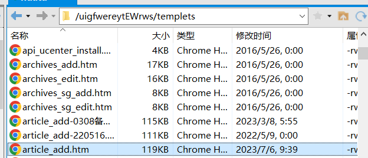
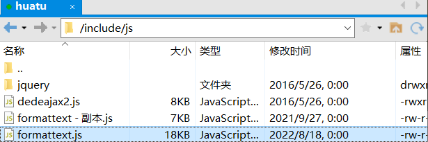
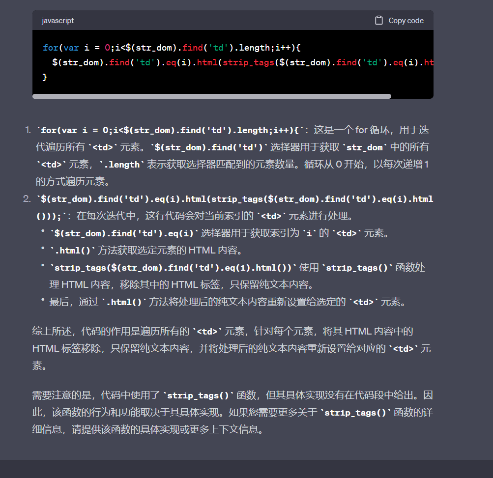

## 一、新增发文页面 过滤表格样式（带链接）功能
需求：点击过滤表格样式，将样式去除，但是链接（a标签保留）

页面：<br>


js：<br>


初始代码：
```javascript
/* 格式化表格 */
function GetContents(){
  var oEditor = CKEDITOR.instances.body;
  var afternr = oEditor.getData();
  var afternr = afternr.replace(/<table[^>]*>/g,"<table>");
  var afternr = afternr.replace(/<tr[^>]*>/g,"<tr>");
  var afternr = afternr.replace(/<td.*((colspan=\"\d+\")|(rowspan=\"\d+\"))[^>]*>/g,"<td $1>");
  var afternr = afternr.replace(/<td\s((?!rowspan)(?!colspan))[^>]*>/g,"<td>");
  var afternr = afternr.replace(/<tbody[^>]*>/g,"<tbody>");
  afternr = afternr.replace(/<th[^>]*>/g,"<th>");
  str_dom = parseDom(afternr);
  for(var i = 0;i<$(str_dom).find('td').length;i++){
    $(str_dom).find('td').eq(i).html(strip_tags($(str_dom).find('td').eq(i).html()));
  }
  oEditor.setData($(str_dom).html());
}
```

修改后：
```javascript
// 格式化表格，带链接
function GetContentslink(){
  var oEditor = CKEDITOR.instances.body;
   var afternr = oEditor.getData();
   var afternr = afternr.replace(/(<table[^>]*)(style="[^"]*")([^>]*>)/g, '$1$3');
   var afternr = afternr.replace(/(<tr[^>]*)(style="[^"]*")([^>]*>)/g,"$1$3");
   // td标签里面有一个style，而a标签里面还有一个style 所以需要分别去除
   var afternr = afternr.replace(/(<td[^>]*)(style="[^"]*")([^>]*>)/g,"$1$3");
   var afternr = afternr.replace(/(<a[^>]*)(style="[^"]*")([^>]*>)/g,"$1$3");
   
   var afternr = afternr.replace(/<td\s((?!rowspan)(?!colspan))[^>]*>/g,"<td>");
   var afternr = afternr.replace(/<strong[^>]*>/g,"");
   var afternr = afternr.replace(/<tbody[^>]*>/g,"<tbody>");
   afternr = afternr.replace(/<th[^>]*>/g,"<th>");
   str_dom = parseDom(afternr);
   oEditor.setData($(str_dom).html());
}
```

思路:
修改第一行正则匹配，删除掉style的内容，以及删除for循环函数，这个for循环函数作用是
