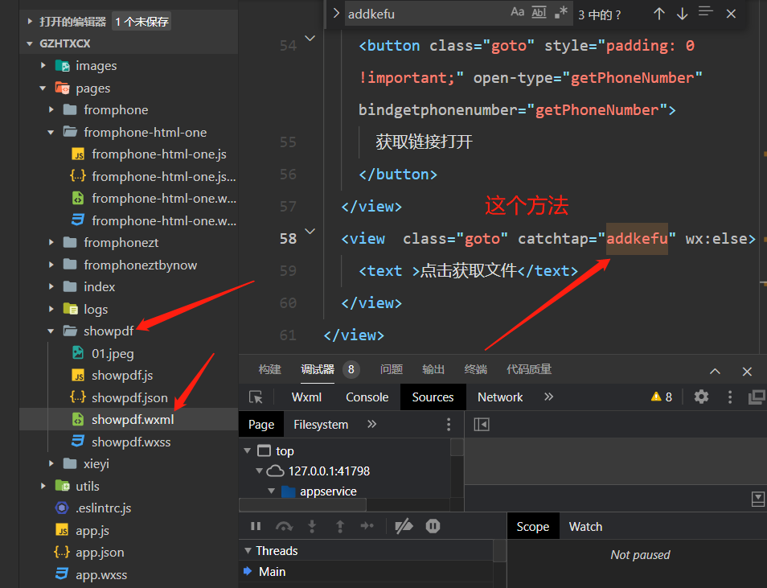
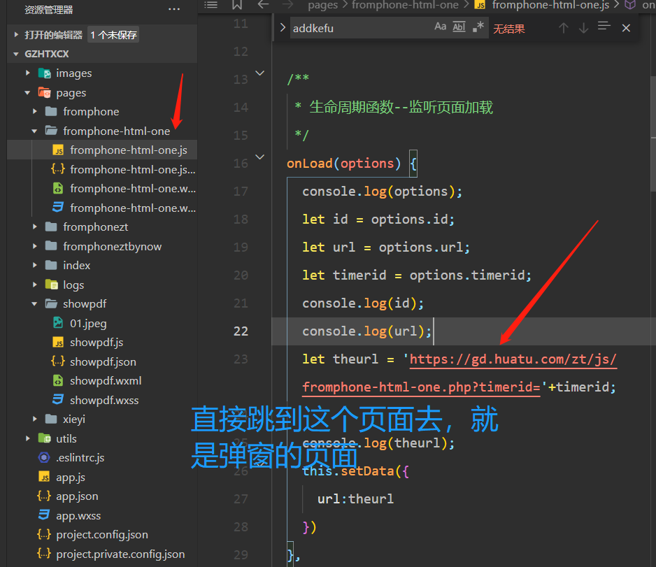

## 十、非微信浏览器领取附件跳小程序的弹窗也要根据ip显示二维码

### 需求描述：在浏览器打开网页领取附件，跳到微信小程序的时候，那个客服二维码设置成根据ip显示

<br>

首先找到小程序的相关代码，在D:\资料\小程序代码\gzhtxcx
<br>

可以在下面这个文件夹找到，那个addkefu, <br>
 <br>
就是这个点击事件，跳到客服二维码页面 <br>
 <br>
控制点击事件的在下面这个文件里，会直接跳到一个链接里面，是个php文件，控制页面的显示 <br>
 <br>

gzhtxcx=> <br>
showpdf=> <br>
showpdf.js=> <br>
addkefu()=> <br>
fromphone-html-one=> <br>
https://gd.huatu.com/zt/js/fromphone-html-one.php?timerid <br>
fromphone-html-one.php 修改这个php就好了 <br>

one和one_backup是备份文件 <br>
_finish和_xg一个是完成文件，一个是完成但是可以测试ip为香港的 <br>

代码这里判断如果ip在广东才加那个选择框进去，

```php
 if (province == '广东省') {
        var selectElement = document.createElement("select");
        selectElement.id = "mySelect";
        selectElement.onchange = selectcode;
        document.getElementById("phoneshowsure").insertAdjacentElement("afterend", selectElement);
   }
```

这里一打开页面不会显示对应ip的客服老师，所以多加了一句话 code = ...

```php
 // --根据城市代码默认显示哪个老师名字和二维码
if (options[i].value === city_code) {
    option.selected = true
    code = 'https://gd.huatu.com/zt/gdhttg/dsggfjewm/' + city_code + '.png';
    // console.log(city_code)
}
```
