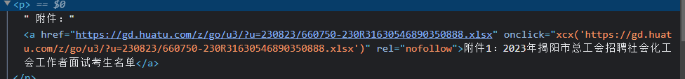
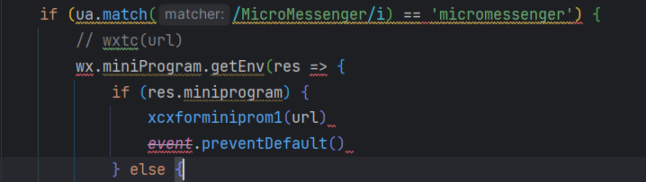
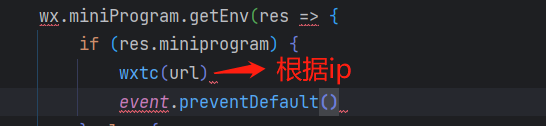
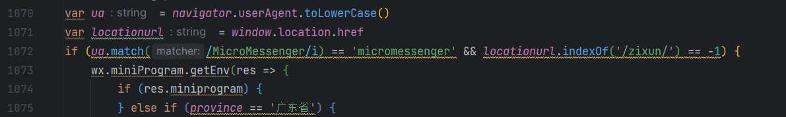
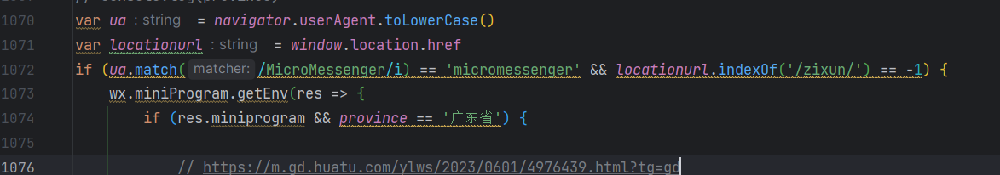

## 十一、微信小程序环境领取附件也是根据ip显示二维码，带zt也根据ip显示

现在又多了一个（之前就有，我第一次见而已）<br>
有一个微信小程序的页面（环境），现在需要在这个页面领取附件的二维码弹窗也显示根据ip显示二维码 <br>

### 网页领取附件js顺序：

> 1.首先判断当前是pc还是移动端，如下，分别进入不同的js（区别编码不同）
>```javascript
>if(window.location.href.indexOf("https://m.")=='-1'){
>document.write('<script src="https://gd.huatu.com/zt/js/gdxcxfunction-gbk.js" ><\/script>');
>}else{
>document.write('<script src="https://gd.huatu.com/zt/js/gdxcxfunction.js" ><\/script>');
>}
>```
>
>2.再根据这个链接携带的参数进入gdxcxfunction.js里面对应的方法（目前都是进入function xcx1(url)这个方法）<br>
> ```javascript
> function xcx(url, text, pic) {
> if ((typeof (url) != 'undefined') && (typeof (text) != 'undefined') && (typeof (pic) != 'undefined')) {
>       xcx3(url, text, pic);
>  } else if ((typeof (url) != 'undefined') && (typeof (text) != 'undefined') && !(typeof (pic) != 'undefined')) {
>     xcx2(url, text);
>  } else if ((typeof (url) != 'undefined') && !(typeof (text) != 'undefined') && !(typeof (pic) != 'undefined')) {
>    xcx1(url);
>  } else {
>     }
> }
>```
>下图是html中链接的点击源码
><div>  </div> <br>
>具体修改逻辑就在gdxcxfunction.js修改就好。

没改之前的环境：<br>

1. 第一个是pc浏览器，直接登录领取附件<br>
2. 二是手机浏览器领取附件，这个时候会直接跳到微信小程序的特定领取附件页面，也是根据ip判断 <br>
3. 微信浏览器打开页面根据ip显示二维码 <br>

现在要在小程序环境也根据ip来，那就该js判断 <br>

之前如果是小程序环境直接跳到xcxforminiprom1这个方法，所以是默认的弹窗 <br>

<div>  </div> <br>

修改后 <br>
<div> </div> <br>

#### 上面改的遇到小程序环境会跳到wxtc方法，也要改遇到小程序环境添加特定弹窗

修改前：<br>
<div> </div> <br>

修改后：<br>
<div> </div> <br>

修改后的xcxforminiprom1不再用，因直接跳到wxtc函数中<br>

基本逻辑：<br>

1. 微信浏览器环境 ->
2. 小程序环境 ->
3. 判断ip的Ajax ->
4. 如果是微信浏览器环境 && 地址不带'/zixun/' ->
5. 是小程序环境或者ip在广东省 ->
6. 地址符合 m.gd || gd. 并且地址不含 '?tg=' 和 '&amp;poptype=1&amp;popkey=' ->
7. 插入ip弹窗 ->>>
8. 否则 域名是对的gd.huatu.com，但是带有特殊标签 -> 默认弹窗
9. ip在广东省，但不是gd.huatu.com的域名，即地市的域名 -> 默认弹窗
10. 否则 ip不在广东省-> 默认弹窗

## 至此完成
