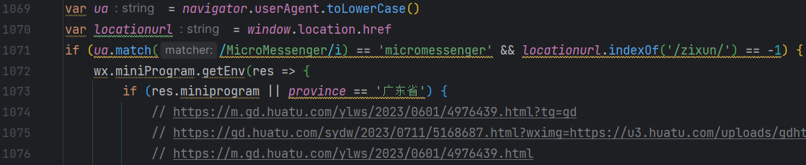

## 十一、微信小程序环境领取附件也是根据ip显示二维码，带zt也根据ip显示

现在又多了一个（之前就有，我第一次见而已） 
有一个微信小程序的页面（环境），现在需要在这个页面领取附件的二维码弹窗也显示根据ip显示二维码  

没改之前的环境： 

1. 第一个是pc浏览器，直接登录领取附件 
2. 二是手机浏览器领取附件，这个时候会直接跳到微信小程序的特定领取附件页面，也是根据ip判断  
3. 微信浏览器打开页面根据ip显示二维码  

现在要在小程序环境也根据ip来，那就该js判断  

之前如果是小程序环境直接跳到xcxforminiprom1这个方法，所以是默认的弹窗  

  
  

修改后  

 
  

#### 上面改的遇到小程序环境会跳到wxtc方法，也要改添加特定弹窗

修改前： 

 
  

修改后： 

 
  

