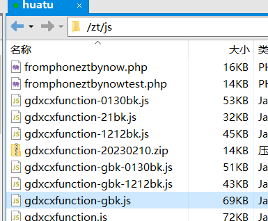
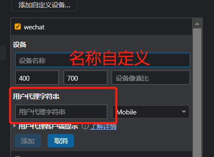
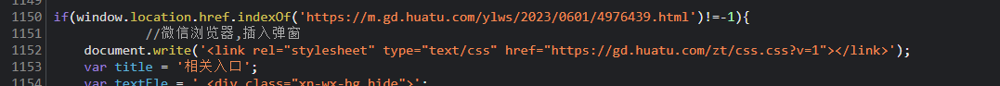
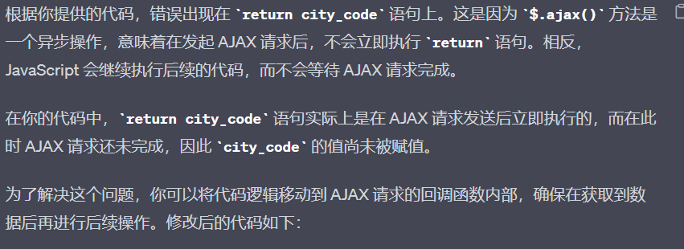
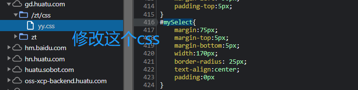

## 二、根据ip地址判断城市，弹出对应的企微二维码

需求：进入带有附件的公告，手机端下载附件时首先查看url地址是否带有类似?tg=gz字段
或者是生成的推广链接，（带有&amp;poptype=1&amp;popkey=）
如果有则原来的领取附件弹窗不改变

> 如果url中仅包含gd.huatu.com字样或者m.华图.com字样，判断ip地址，根据地区显示不同的客服老师以及对应的二维码
    如果ip不在广东省内，默认显示广州二维码，如果在广东省内则根据ip显示


修改这个js:<br>


其中`function xcxforminiprom1(url)`这个函数不用管，因为是小程序环境中的弹窗以及事件

比如测试打开这个网页https://m.gd.huatu.com/ylws/2023/0601/4976439.html
就把js函数的1187行的测试网页改成这个

浏览器f12切换成wechat手机内核
谷歌浏览器模拟微信内置浏览器的方法：
浏览器f12添加新的设备


用户代理字符串复制进去就ok：如下<br>
`Mozilla/5.0 (Linux; Android 7.0; MI 5s Build/NRD90M; wv) AppleWebKit/537.36 (KHTML, like Gecko) Version/4.0 Chrome/64.0.3282.137 Mobile Safari/537.36 wxwork/2.4.16 MicroMessenger/6.3.22 NetType/WIFI Language/zh`

将写好的js复制到网页中的gdxcxfunction.js
然后设置断点，在第一句代码那里
点一次附件，下载后返回，重新赋值进去，点调试的按钮（使劲点）好了之后
直接在控制台输入wxtc(url) 就可以查看弹窗效果

运行一次调试，如果走到1150行  (1150行的地址已经替换成测试网页)



之后没反应，直接在控制台输入wxtc(url) 就可以查看弹窗效果


改变这个code的值就改变弹窗上面的二维码，


通过这里判断条件通过ip判断不同的地区，将code的值变成对应的地区 (做到这里二维码没变，不知道为什么了....) 改成match就行了
因为ajax请求是异步的，要添加两句代码将他变为同步操作，再返回
之所以拿不到code的准确值是因为前面一个是错误，后面的那个是空值，导致或比较两个都是错误的，
```javascript
async: false,
return city_code
```



修改这个css代码， 代码写好 finish代码:<br>


这段代码是通过选择框显示对应的二维码，函数跟函数分开，函数也可以写在另一个函数内，但是需要引用函数，
这里选择相应的老师没有显示出对应的二维码是因为没有写最后一句，将code的值赋给html的类名为wxewm的标签中！！

```javascript
// --选择老师显示对应二维码
function selectcode() {
  // var select = document.getElementById('mySelect')  //获取页面选择框
  var select = $('#mySelect')
  // var wxewm = document.getElementById('wxewm')  //获取二维码展示的那个标签
  var wxewm = $('#wxewm')
  // var selectedValue = select.value
  var selectedValue = select.val()


  // console.log(selectedValue) // 在控制台打印选择框的值
  // console.log(city)
  // console.log(code)
  // wxewm.src = 'https://gd.huatu.com/zt/gdhttg/dsggfjewm/' + select.value + '.png'
  wxewm.attr('src', 'https://gd.huatu.com/zt/gdhttg/dsggfjewm/' + selectedValue + '.png') //--设置src的值
  var code = wxewm.attr('src') //--将src的值赋给code
  // console.log(code)
  $('.wxewm').attr('src', code) //--把页面中类名为wxewm的src的值设置为code的值！
}
```

