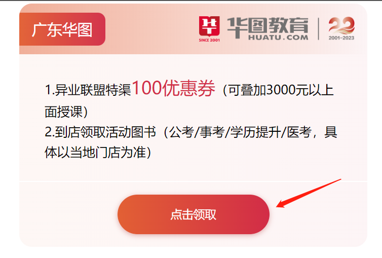
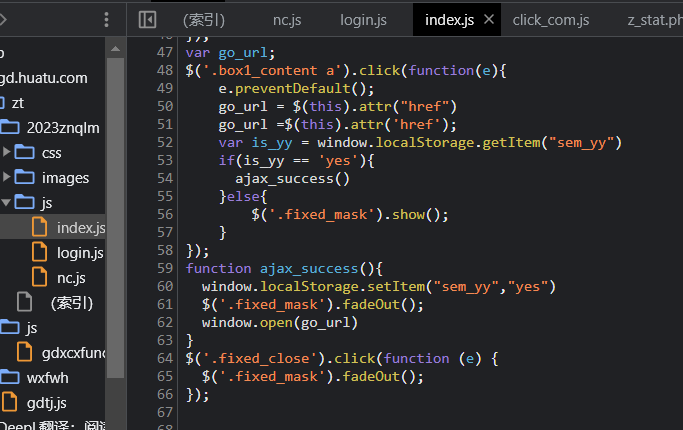
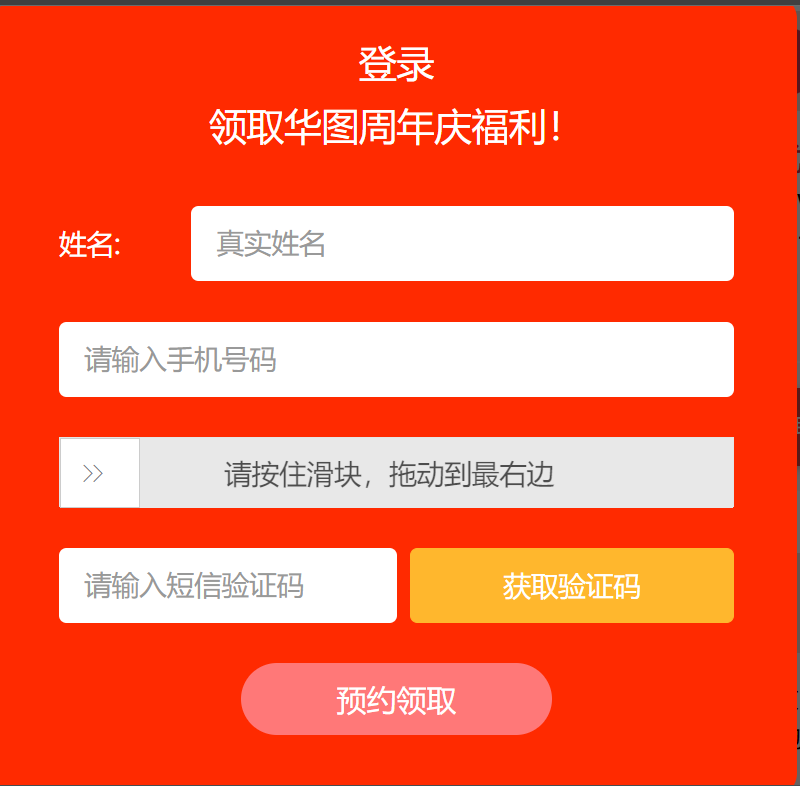
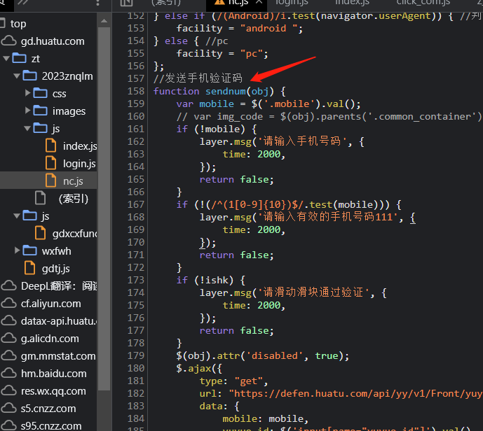
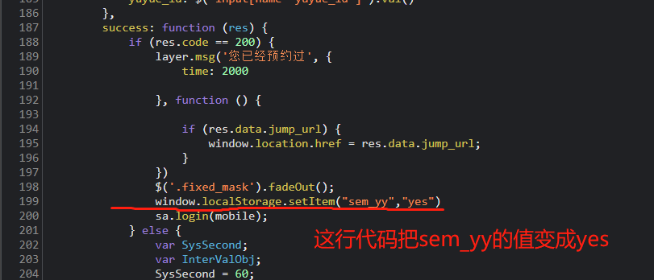
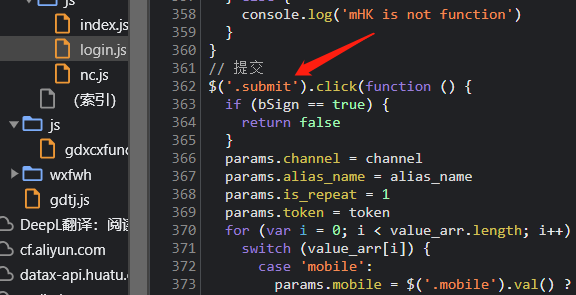
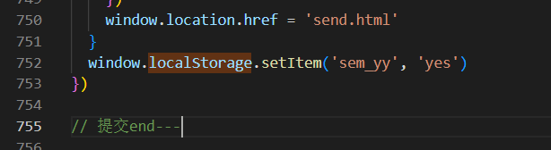
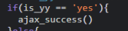
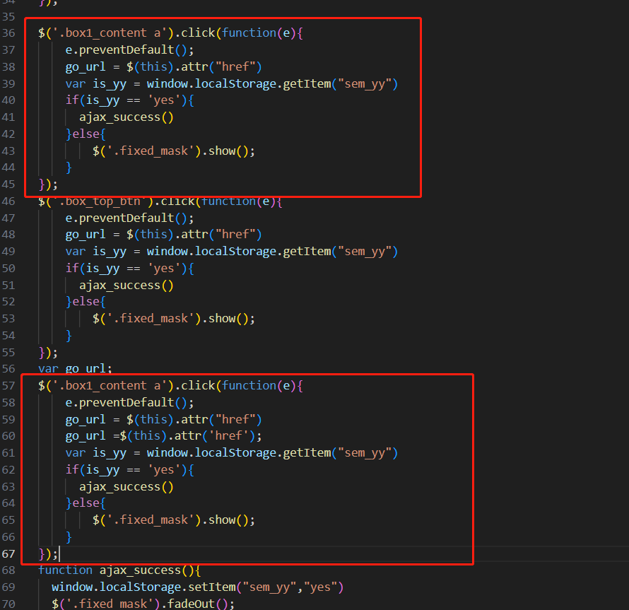

## 四、领取资料页面，第二次点击直接跳转

从xfpt上传文件会有8个小时的时差，xfpt显示时间比本地时间往前早了8h

这个链接实现的功能有问题 
`https://gd.huatu.com/zt/2023znqlm/`

**index.js**  

第一次点击 因为页面没有localStorage，所以会走到else那里，把.fixed_mask显示出来，
这个逻辑：

**nc.js** 
“获取验证码按钮”的逻辑在 

**login.js** 
“预约领取”的按钮功能实现在这

在这个功能的最后一行添加一句存储缓存的代码（让他点击领取就存一次缓存） 

所以第二次点击的时候直接走这个逻辑，跳链接 

中间的login.js有两个重复的弹窗请求，删了一个（删了上面的那一个） 

