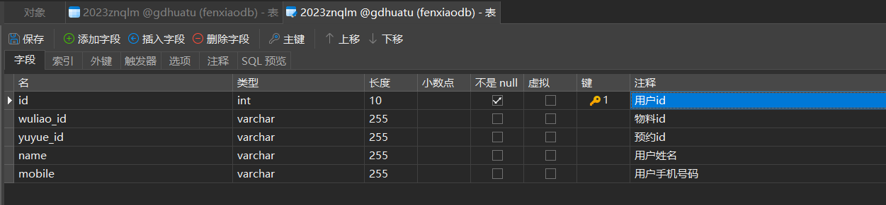
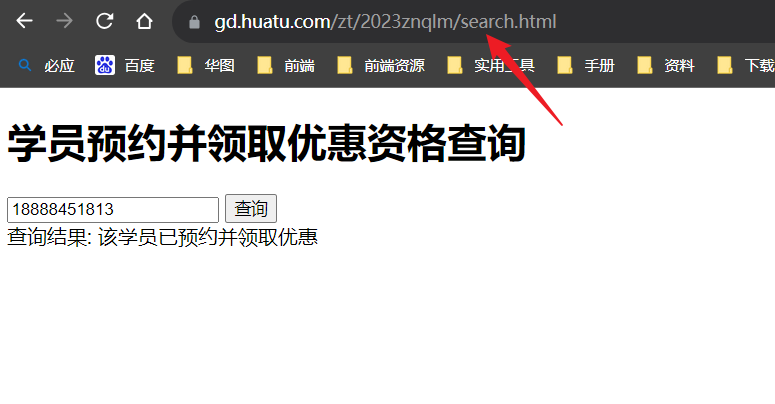

## 五、存手机号码到本地数据库并查询
需求：<br>
在需求四的那个页面预约领取的时候把用户的手机号码存到广东分校的数据库并做一个简单的html页面查询这个手机号码，
查询成功就给个提示说有什么优惠，查不到就错误提示

### 1.建表<br>
1.首先要在代码中把信息存入数据库里面 ，建一个数据表<br>

<br>

### 2.login.js<br>
2.在login.js的代码里面加入Ajax请求<br>
因为代码里面没有name字段，这里自己声明一个<br>
这里几个要注意的点
>要用get方法<br>
>不需要同步方式<br>
>请求的地址（url）,在调试的时候浏览器看不见php文件，实际上已经上传到服务器，这里直接使用他的地址才行！！<br>
>数据一定要正确，可以先在控制台打印data是否想要的数据，不然存失败或者找不到对应的数据
```javascript
  // 往数据库存手机号码的ajax请求
  var name = $('.trueName').val()
  $.ajax({
    type: 'get',
    url: 'https://gd.huatu.com/zt/2023znqlm/api/utl.php',
    data: { mobile: params.mobile, name: name }, // 将手机号作为数据发送到后端

    success: function (response) {
      // 在请求成功后的处理逻辑
      if (response.success) {
        console.log('保存手机号码成功')
      } else {
        // 存储失败或出现错误
      }
    },
    error: function (error) {
      // 请求失败的处理逻辑
      console.log('保存失败')
    },
  })
  // 往数据库存手机号码的ajax请求
```
<br>

### 3.utl.php<br>
3.编写php文件，utl.php<br>
这里使用pdo连接数据库，并使用预处理语句插入数据到数据库，确保数据安全<br>
>SQL语句不能写错！！！名称要对应前端传过来的！！！
```php
<?php
// 连接数据库
$servername = "172.23.0.141";
$username = "gd";
$password = "huatu123465";
$dbname = "gdhuatu";

try {
  $conn = new PDO("mysql:host=$servername;dbname=$dbname", $username, $password);
  // 设置 PDO 错误模式为异常
  $conn->setAttribute(PDO::ATTR_ERRMODE, PDO::ERRMODE_EXCEPTION);

  // 接收前端发送的手机号
  if (isset($_GET['mobile'])) {
    $mobile = $_GET['mobile'];

    // 如果存在 yuyue_id 则使用传递的值，否则设为 1113777
    $yuyue_id = isset($_GET['yuyue_id']) ? $_GET['yuyue_id'] : 1113777;

    // 如果存在 wuliao_id 则使用传递的值，否则设为 200008
    $wuliao_id = isset($_GET['wuliao_id']) ? $_GET['wuliao_id'] : 200008;

    // 接收前端发送的姓名
    $name = $_GET['name'];

    // 使用预处理语句插入数据到数据库
    $stmt = $conn->prepare("INSERT INTO 2023znqlm (mobile, yuyue_id, wuliao_id, name) VALUES (:mobile, :yuyue_id, :wuliao_id, :name)");
    $stmt->bindParam(':mobile', $mobile);
    $stmt->bindParam(':yuyue_id', $yuyue_id);
    $stmt->bindParam(':wuliao_id', $wuliao_id);
    $stmt->bindParam(':name', $name);

    if ($stmt->execute()) {
      $response = array('success' => true);
      echo json_encode($response);
    } else {
      $response = array('success' => false);
      echo json_encode($response);
    }
  }
} catch (PDOException $e) {
  echo "连接失败: " . $e->getMessage();
}

```
#### 至此已经可以把数据存入数据库里面

## 从数据库查询刚才存入的数据
### 1.前端页面<br>
>这里的url地址依然是线上地址<br>也是get方式
```html
<!DOCTYPE html>
<html>
  <head>
    <meta charset="UTF-8" />
    <title>学员预约并领取优惠资格查询</title>
    <script src="https://code.jquery.com/jquery-3.6.0.min.js"></script>
  </head>
  <body>
    <h1>学员预约并领取优惠资格查询</h1>
    <input type="text" id="mobile" placeholder="请输入学员手机号" />
    <button id="queryBtn">查询</button>
    <div id="result"></div>

    <script>
      $(document).ready(function () {
        // 监听查询按钮点击事件
        $('#queryBtn').click(function () {
          var mobile = $('#mobile').val()

          // 发送 AJAX 请求到服务器
          $.ajax({
            url: 'https://gd.huatu.com/zt/2023znqlm/api/query.php', // 修改为您的服务器端处理查询的 PHP 文件
            method: 'GET',
            data: { mobile: mobile },
            dataType: 'json',
            success: function (response) {
              if (response.success) {
                $('#result').html('查询结果: ' + '该学员已预约并领取优惠') // 修改为您需要显示的查询结果
              } else {
                $('#result').html('查询失败')
              }
            },
            error: function () {
              $('#result').html('查询出错')
            },
          })
        })
      })
    </script>
  </body>
</html>

```

### 2.后端php请求<br>
```php
<?php
// 连接数据库
$servername = "172.23.0.141";
$username = "gd";
$password = "huatu123465";
$dbname = "gdhuatu";

try {
  $conn = new PDO("mysql:host=$servername;dbname=$dbname", $username, $password);
  // 设置 PDO 错误模式为异常
  $conn->setAttribute(PDO::ATTR_ERRMODE, PDO::ERRMODE_EXCEPTION);

  // 检查是否有 mobile 参数传递
  if (isset($_GET['mobile'])) {
    $mobile = $_GET['mobile'];

    // 使用预处理语句进行查询
    $stmt = $conn->prepare("SELECT * FROM 2023znqlm WHERE mobile = :mobile");
    $stmt->bindParam(':mobile', $mobile);
    $stmt->execute();

    // 获取查询结果
    $result = $stmt->fetchAll(PDO::FETCH_ASSOC);

    if ($result) {
      // 查询成功，将结果返回给前端
      $response = array('success' => true, 'data' => $result);
      echo json_encode($response);
    } else {
      // 查询无结果
      $response = array('success' => false, 'data' => 'No data found');
      echo json_encode($response);
    }
  } else {
    // 缺少 mobile 参数
    $response = array('success' => false, 'data' => 'Missing mobile parameter');
    echo json_encode($response);
  }
} catch (PDOException $e) {
  // 连接或查询失败
  $response = array('success' => false, 'data' => 'Error: ' . $e->getMessage());
  echo json_encode($response);
}

```
## 查询结果<br>

