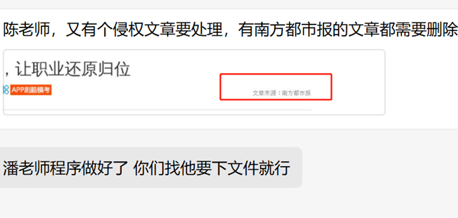
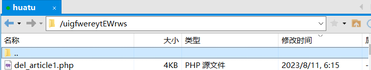
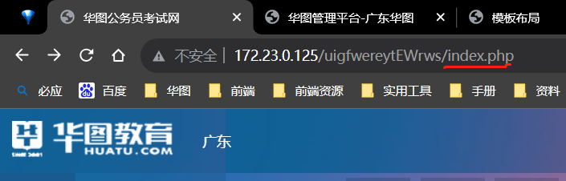
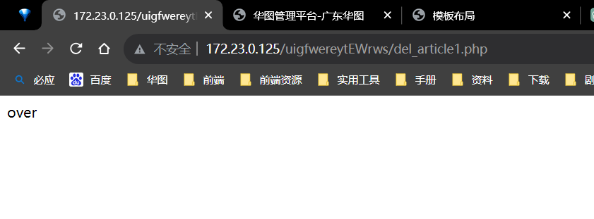

## 六、清理文章后台侵权文章

 

### 操作步骤

1. 把这个文件上传到自己的服务器,这个目录下

 

2. 打开网站后台，这里  

  
3. 把后面的index.php替换成del_article1.php，回车运行就好,运行结果：

    
4. 查看是否已经删除,在这里搜一下id，  

 
如果没搜到，用这个链接再搜一下试试，把后面的两个id改成要搜的那个id
`http://172.23.0.125/uigfwereytEWrws/recyclingtest.php?oneid=2528289&lastid=2529008`  

#### 两个都没搜到那就是完全删除了