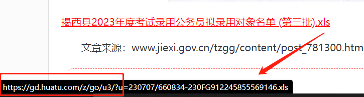
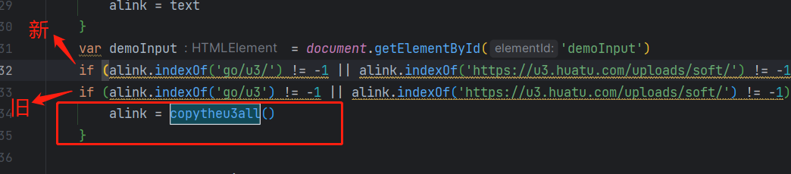

## 七、领取附件加判断和链接变短

### 下载链接加判断：


<br>

 <br>
加个判断就好了，gdxcxfuntion.js 第30行那里 <br>
`if (url.indexOf('go/u3/') != -1 || url.indexOf('https://u3.huatu.com/uploads/soft/') != -1 || url.indexOf('xls') != -1 || url.indexOf('pdf') != -1 || url.indexOf('doc') != -1 || url.indexOf('xlsx') != -1) ` <br>

### 这里的判断只会让点击非huatu域名的链接时出现弹窗，但是不会进行复制他。 <br>

若要进行复制就要改变下面进行复制时的条件，将之前的判断改成”新“的这个，这样是个文件就会复制。一共有6个地方好像,搜这个copytheu3all()
方法 <br>



### 可以进行复制但是不会全部复制，只是把那个非华图的那个链接单独复制了

因为这里之只把链接匹配到go/u3或https://u3.huatu.com/uploads/soft/ 添加进去，这里在后面继续添加条件 <br>
把

```javascript
if (RegExp.$1.indexOf('go/u3') != -1 || RegExp.$1.indexOf('https://u3.huatu.com/uploads/soft/') != -1) {

}
```

改成

```javascript
if (RegExp.$1.indexOf('go/u3') != -1 || RegExp.$1.indexOf('https://u3.huatu.com/uploads/soft/') != -1 || RegExp.$1.indexOf('xls') != -1 || RegExp.$1.indexOf('xlsx') != -1 || RegExp.$1.indexOf('pdf') != -1 || RegExp.$1.indexOf('doc') != -1) {

}
```

最终是这样

```javascript
 while (re.exec(str) != null) {
    if (RegExp.$1.indexOf('go/u3') != -1 || RegExp.$1.indexOf('https://u3.huatu.com/uploads/soft/') != -1 || RegExp.$1.indexOf('xls') != -1 || RegExp.$1.indexOf('xlsx') != -1 || RegExp.$1.indexOf('pdf') != -1 || RegExp.$1.indexOf('doc') != -1) {
        htmlstr +=
            '>>>>' + RegExp.$2 + '\r\n' + RegExp.$1.replace('https://gd.huatu.com/z/go/u3/?u=', 'https://u3.huatu.com/uploads/soft/') + '\r\n\r\n'
    }
    //如果是RegExp.$1那么匹配的就是href里的属性了!
}
```

#### 这里的链接替换不能修改，一修改文件就找不到了。  '>>>' + RegExp.$2 这句话

### 链接变短（因没有免费的接口，暂时不做）