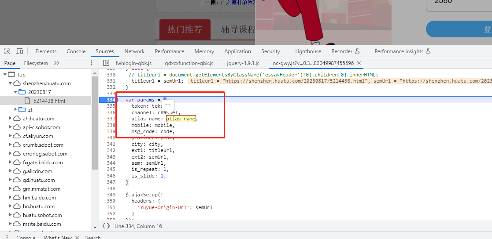
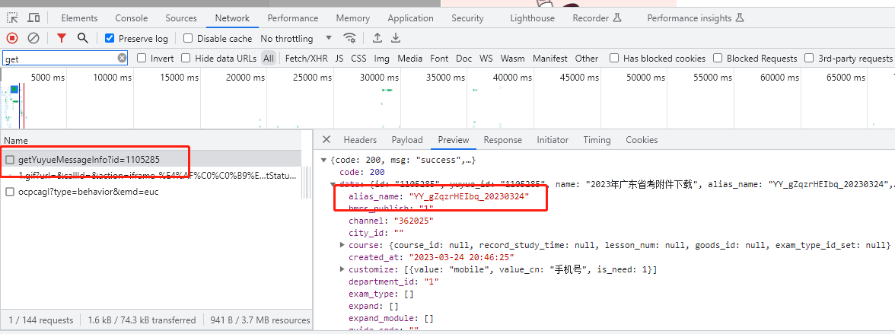

## 八、网页版领取附件，alias_name参数错误

### 描述：

所有的网页版领取附件，发送手机验证码，点登录的时候，会弹alias_name参数错误，但是一样可以下载附件  

最下面的图片是页面加载的时候请求的东西，第一个是点击登录的参数构成，应该是要把加载的这个东西的信息给构建的，
现在是没有，就把这个请求的信息保存好在页面上，点击登录的时候放进去就好了

# 莫名其妙的又好了