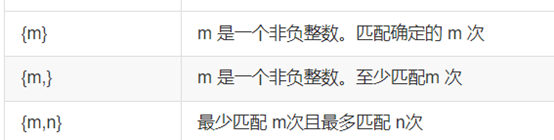

## js正则
`if(/.*[\u4e00-\u9fa5]+.*$/.test(url)) ` 
1 / 表示正则开始标志 
2 .*表示匹配零个或多个任意字符 
3 [\u4e00-\u9fa5]: 方括号中的表达式，表示匹配中文字符的范4 围。\u4e00表示中文字符的起始编码，\u9fa5表示中文字符的结束编码。
5 +表示匹配前面的表达式一次或多次 
6 $表示正则结束标记 
7 .test(url)：使用正则表达式的test()方法检查字符串变量url是否与正则表达式匹配。
 

**正则表达式后面有个 i  表示不区分大小写，U 表示取消贪婪匹配**

1.	\* 匹配前面的字符零次或者多次 相当于 {0，}

2. \. 匹配除了换行符外的任意一个字符, **通常可以使用 .\* 组合来匹配除换行符外的任何字符**

3.	\+ 匹配前面的字符一次或多次 相当于{1，}

4.	？匹配前面的字符零次或一次 相当于{0，1}

5.	| 匹配两个或者多个选择 

6.	^ 匹配字符串的开始位置

7.	$ 匹配字符串的结束位置

8.	\b 匹配单词的边界，匹配特殊字符

9.	\B 匹配除了特殊字符以外的字符

10.	[  ] 匹配方括号中的任意一个字符

11.	[^ ] 匹配除了方括号中的字符外的任意字符

12.	( ) 表示匹配的一个整体

13.	\d 匹配一个数字 [0-9]

14.	\D 匹配除了数字之外的任意一个字符 [^0-9]

15.	\w 匹配一个英文字母、数字或者下划线 [0-9a-zA-Z_]

16.	\W 匹配除了英文字母、数字或下划线的任意一个字符[^0-9a-zA-Z_]

17.	\s 匹配一个空白字符 [\f\n\r\t\v]

18.	\S匹配除了空白字符以外的任意一个字符 [^\f\n\r\t\v]

19.	`if (!(/^(1[0-9]{10})$/.test(mobile)))` {10}表示匹配10次数字0-9,（看下表）

