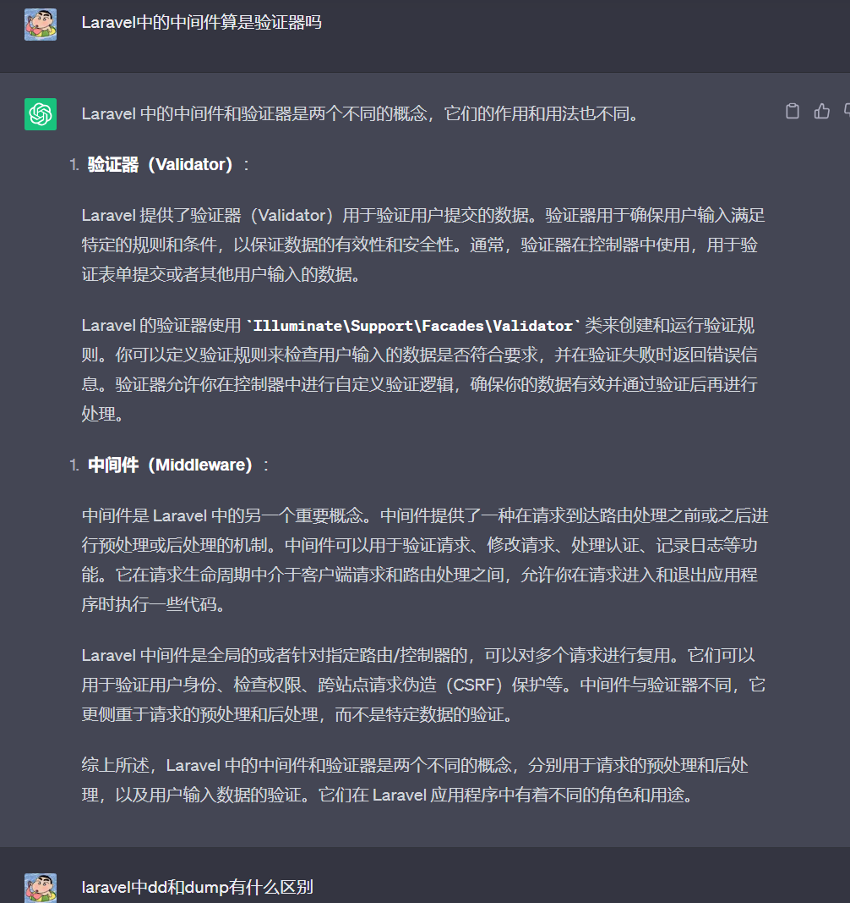
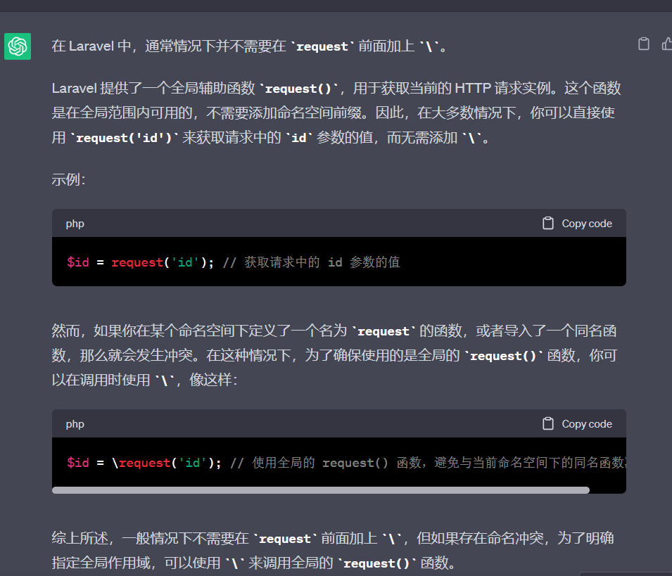
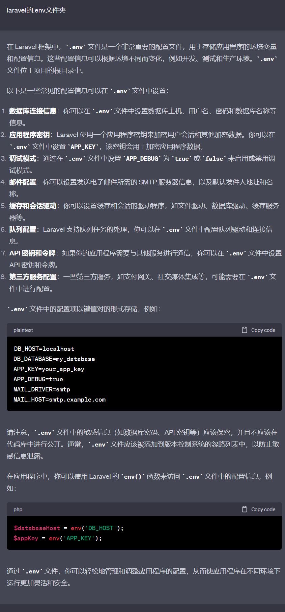

## 笔记
### Laravel中 的中间件 和 验证器

### dd()和dump()
1. dd() 函数用于输出变量的值并终止程序执行。它会在输出变量值的同时停止脚本的执行，也就是说，在调用 dd() 后，后续的代码将不会执行。这在调试过程中非常有用，因为它可以让你查看变量的值，检查问题，并确保代码执行到特定位置。
2. dump() 函数用于输出变量的值，但不会停止程序执行。它会将变量的值打印到页面上，并继续执行后续代码。这个函数在调试时通常用于查看变量的内容，而不影响代码的正常执行流程。

### 函数前的反引号\



## .env环境变量文件


## 中间件
中间件提供了一种方便的机制来过滤进入应用程序的 HTTP 请求。例如，Laravel 包含一个验证用户身份的中间件。如果用户未能通过认证，中间件会把用户重定向到登录页面。反之，用户如果通过验证，中间件将把请求进一步转发到应用程序中<br>

## 控制器的创建
1. `php artisan make:controller DemoController` 普通控制器
2. `php artisan make:controller ProvisionServer --invokable`单行为控制器 (单行为控制器（Single Action Controller）是一种特殊类型的控制器，它只包含一个方法来处理一个特定的 HTTP 请求。这种控制器通常用于简单的操作，特别是当你只需要处理一个简单的动作而不需要其他方法时。)
3. `php artisan make:controller ResourceController --resource`包含了index、create、store、show、edit、update、destroy 等方法。
4. `php artisan make:controller ApiController --api`快速生成不包含 create 和 edit 方法的用于开发接口的资源控制器。
<br>

## 请求对象
可以从前端页面拿取一些值<br>
```php
 public function add(Request $request)
    {
        // 获取请求的值
        $username = $request->input('username');
        dump($username);
        
        // 获取请求的路径
        $uri = $request->path();
        dump($uri);
        
        // 获取请求的地址
        $url = $request->url();
        dump($url);
        
        // 获取请求方法
        $method = $request->method();
        dump($method);

        // 判断请求类型
        if($request->isMethod('post'))
        {
            echo '这是post请求';
        }
        
        // 检索所有传入请求的输入数据 无论传入的请求是来自 HTML 表单还是 XHR 请求，都可以使用此方法
        $input = $request->all();
        dump($input);
    }
```
<br>

## Eloquent ORM模型
就是Model，可以把模型看成是数据库的增强版,因为模型里面已经定义了数据库，主要绑定数据库以及一些curd操作等<br>

## 表单验证
1.可以把验证规则写在Controller里面，像这样<br>
```php
public function addform(UserRequest $userRequest)
    {
        // 验证规则 验证规则可以以|分割字符串写法或者以数组写法
        $rules = [
            'email' => 'required|unique:user', // 必填且唯一
            'password' => ['required','min:6','max:10'] // 必填 最短6 最长10
        ];
        
        // 自定义错误信息
        $message = [
          'email.required' => '用户名必填！',
          'email.unique' => '该用户名已被注册，请重新输入',
          'password.required' => '密码必填',
          'password.min' => '密码长度最短为6个字符',
          'password.max' => '密码长度最长为10个字符'
        ];
        
        $email = $userRequest->old('email');
        $password = $userRequest->old('password');
        
        $validator = Validator::make($request->all(),$rules,$message);
        
        if($validator->fails())
        {
            return redirect('admin/user/add')->withErrors($validator)->withInput();
        }
        dump($validator);
    }
```
<br>
2.也可以写在 表单验证请求里面，先创建一个请求<br>
`php artisan make:request UserRequest` <br>
该命令生成的类将被置于 app/Http/Requests 目录中<br>

### UserRequest.php
```php
<?php

namespace App\Http\Requests;

use Illuminate\Foundation\Http\FormRequest;

class UserRequest extends FormRequest
{
    /**
     * Determine if the user is authorized to make this request.
     *      授权验证
     * 判断用户是否有请求权限
     * @return bool
     */
    public function authorize()
    {
        return true;
    }

    /**
     * Get the validation rules that apply to the request.
     * 获取应用于该请求的验证规则
     * @return array
     */
    public function rules()
    {
        return [
            //
            'email' => 'required|unique:user', // 必填且唯一
            'password' => ['required','min:6','max:10'] // 必填 最短6 最长10
        ];
    }

    /**
     * 定义验证规则的错误消息
     * @return array
     */
    public function messages()
    {
        return [
            'email.required' => '用户名必填！',
            'email.unique' => '该用户名已被注册，请重新输入',
            'password.required' => '密码必填!!!',
            'password.min' => '密码长度最短为6个字符',
            'password.max' => '密码长度最长为10个字符'
        ];
    }
}

```
然后在使用的地方调用就行<br>

```php
 $email = $userRequest->old('email');

 $Validated = $userRequest->validated();
 dump($Validated);
```
<br>

## 视图&&blade模板引擎

好像就是可以吧组件布局或者模板布局嵌入到某个页面里面，类似与前端的组件
