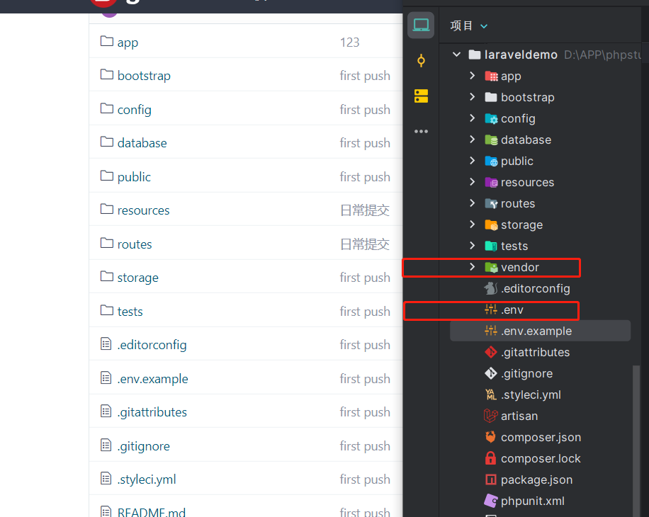

## 从Git拉取Laravel项目并运行到本地

1. 本地选择一个文件夹用来拉取laravel项目 git clone<br>
2. 然后打开这个文件夹下面的cmd（终端）<br>
   接下来我们需要进行composer install来解决dependencies：<br>
`composer install` <br>

   有时候可能让你update 那就按照提示运行指令<br>
3. 完成后，我们需要建立.env文件，因为.env默认是github所忽略的文件：<br>
`cp .env.example .env`<br>
   若是不行，那就手动复制.env.example文件夹并更名为.env <br>
4. 因为env.example中默认没有app key，所以我们在.env中生成新的app key：<br>
`php artisan key:generate`<br>
5. 接下来打开我们刚复制的.env文件，将**数据库**信息填入相应的位置：<br>
```javascript
APP_ENV=local
APP_KEY=base64:H6RIhyLBY-SOME-KEY-HERE-FkzCvGdS8WOU= //应用程序密钥
APP_DEBUG=true
APP_LOG_LEVEL=debug
APP_URL=http://localhost

// 数据库信息
DB_CONNECTION=mysql
DB_HOST=127.0.0.1
DB_PORT=3306
DB_DATABASE=my_dbname    // 数据库名
DB_USERNAME=homestead    // 用户名
DB_PASSWORD=secret       // 密码
```
6.保存后，运行<br>
`php artisan migrate`<br>

如果有seeder的话，进行数据库迁移，，运行<br>
`php artisan db:seed`<br>

### 因为上传到git的时候会把vendor和.env两个忽略 所以上面2  3 步骤就是在本地创建这两个<br>
vendor 目录包含你的 Composer 依赖包<br>
.env 就是程序运行的环境变量<br>

主要是.env环境配置好之后就可运行了<br>
