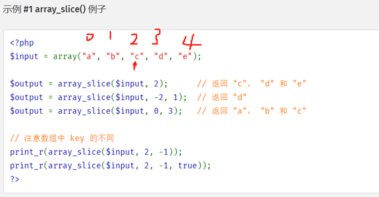

## 一.PHP的各个函数及其作用

1. strlen --获取字符窜长度
2. count --统计数组、对象中中所有元素的数量
3. array_count_values --统计数组中的每个值出现的次数
4. ***arsort*** --对数组进行降序排序并保持索引关系 5 4 3 2 1
5. asort --对数组进行升序排序并保持索引关系 1 2 3 4 5
6. array_keys --返回数组中部分或所有的键名
7. array_slice --从数组中取出一段 
   
8. extract --从数组中将变量导入到当前的符号表（从数组里面提取元素）
9. `$pq = new SplPriorityQueue`; //$pq 是一个空的优先队列对象。
10. str_split --将字符串转换为数组
11. explode --将一个字符串按照指定的分隔符拆分成数组，返回的数组的元素是字符串片段。
12. implode --将数组元素连接成字符串
13. str_split --用于将一个字符串拆分成单个字符的数组。返回的数组的元素是单个字符。
13. trim --从字符串的两端删除空白字符和其他预定义字符。
14. ksort --对数组根据键名升序排序(小到大)
15. krsort --对数组按照键名逆向排序
16. array_search --在数组中搜索给定的值，如果成功则返回这个值相应的键名，返回要找的那个值得键名
17. max --找出数组中的那个最大值
18. min --返回该数组中的最小值
18. end --将数组的内部指针指向最后一个单元,返回数组的最后一个元素
19. array_pop --弹出数组最后一个单元（出栈）
20. array_rand --从数组中随机取出一个或多个随机键,随机一个索引
21. sort --对数组进行升序排列，并且会重新排列索引数组的键
22. array_intersect --计算数组的交集
23. compact --建立一个数组，包括变量名和它们的值,以数组的方式输出