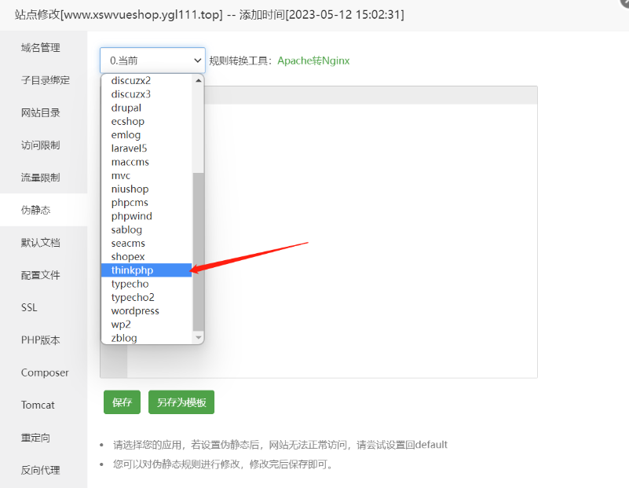

# Vue项目上线流程

vue项目功能全部完成之后打包进行上线

### 1.更改项目后台地址

因为项目上线，不能再用本地数据库以及后台，所以改成线上地址

 

将target：里面的本地后台注释掉，换成上线之后的后台网站，（上线之后的网站为宝塔面板中自己创建的后台网站名字，如下：） 
这里的网站一定是后台网站！！！不是前端显示页面的网站！！！

  

### 2.项目打包

打开项目文件夹找到 .gitignore文件，将里面的dist注释掉  

 

打开本项目终端，运行`npm run build`，将文件打包。

### 3.上传到git仓库

新建git项目仓库，将刚才打包好的项目上传到git仓库中  

##### 前端显示页面为刚才打包好的项目文件，上传之后是最新的项目，后台管理界面（k2222fastpro）也要重新同步一次，把最新的上传到git仓库，再打开Linux面板，在终端中把git仓库中最新的代码拉取下来，不然正常运行就会报错！！！

### 4.把项目拉取到宝塔

打开宝塔Linu面板。将项目从git克隆到宝塔服务器的指定文件夹内。  

### 5.选择宝塔里vue项目的运行目录为/dist,伪静态修改为thinkphp

 

 

### 6.这时候打开网站但是不能登录，需要设置反向代理，步骤如下：

找到网站的配置文件
 
将下面这段代码添加到配置文件中，要把www.online.com修改为线上的后台地址。
网站也是后台网！！！不是前端显示页面的网站！！！

 

 

至此，操作完成，打开项目地址即可进入到上线后的vue项目。

