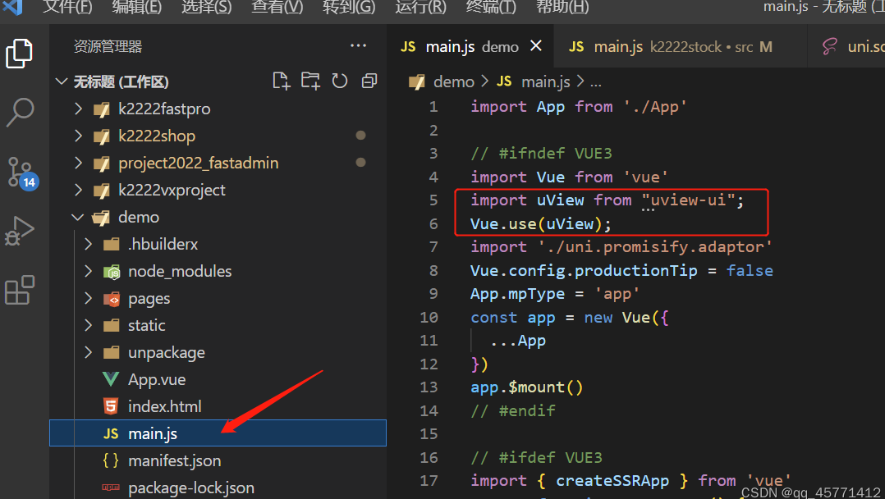

# 微信小程序创建并微信开发者工具

uni-app项目脚手架创建、配置uview、以及运行至微信开发者工具

## 一.若是Hbulider-x编译器创建，步骤如下：

#### 1.创建项目 <br>

<div></div>

#### 2.引入插件 <br>

创建完成后引入uview2.0插件，打开官网https://www.uviewui.com/components/intro.html <br>

选择npm方式安装配置 <br>
<div></div>

#### 3.终端执行命令

在终端中打开项目并运行下面三个命令

```javascript
// 安装sass
npm i sass -D

// 安装sass-loader，注意需要版本10，否则可能会导致vue与sass的兼容问题而报错
npm i sass-loader@10 -D

// 安装uview-ui组件
npm install uview-ui@2.0.31
```


#### 4.配置文件

1）引入uView主JS库<br>
在项目src目录中的main.js中，引入并使用uView的JS库，注意这两行要放在import Vue之后。<br>

```javascript
// main.js
import uView from "uview-ui";

Vue.use(uView);
```

<div></div><br>

2）在引入uView的全局SCSS主题文件 ,在项目src目录的uni.scss中引入此文件。

```javascript
/* uni.scss */
@import
'uview-ui/theme.scss';
```

<div></div><br>

3）引入uView基础样式 <br>

<div></div><br>
```javascript
<style lang="scss">
    /* 注意要写在第一行，同时给style标签加入lang="scss"属性 */
    @import "uview-ui/index.scss";
</style>
```

<div></div><br>

4）配置easycom组件模式 此配置需要在项目src目录的pages.json中进行。 <br>

```javascript
// pages.json
{
    "easycom": {
    "^u-(.*)": "uview-ui/components/u-$1/u-$1.vue"
},

    // 此为本身已有的内容
    "pages": [
    // ......
]
}
```

<div></div><br>


5）Cli模式额外配置（脚手架创建的项目要额外配置）<br>
> 如果您是vue-cli模式的项目，还需要在项目根目录的vue.config.js文件中进行如下配置：<br>

```javascript
// vue.config.js，如没有此文件则手动创建
module.exports = {
    transpileDependencies: ['uview-ui']
}
```

<div></div><br>

6）打开微信开发者工具，找到设置->通用设置->安全，打开服务端口 <br>

<div></div><br>

7）打开hbulider-x直接运行到微信开发者工具即可<br>
<div></div><br>

## 二.若是通过Cli创建，步骤如下：

1.创建文件夹，cd，终端打开，输入命令创建项目 <br>

```javascript
// k2222stock为项目名字
vue create -p dcloudio/uni-preset-vue k2222stock
```

> 选择默认模板就行

2.输入代码引入uview <br>

```javascript
// An highlighted block
npm install uview-ui

npm i sass -D

npm i sass-loader@10 -D
```

3.输入 npm run serve即可本地运行，好像yarn serve也可以 <br>

4.找到自己的小程序的appid，填入 <br>
<div></div><br>

5.输入代码运行到微信开发者工具 <br>

```javascript
// An highlighted block
npm run dev:mp-weixin
```

> 若是hbulider运行之后微信开发者工具没反应要导入当前项目进去：（这个文件夹) <br>
<div></div><br>

### ok至此完成